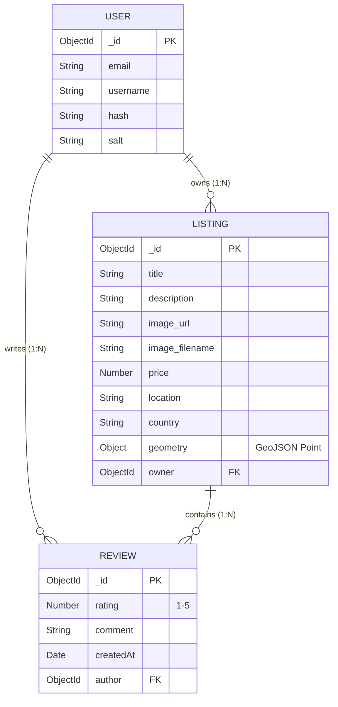

<div align="center">
  
  
  <h1>🏡 WanderLust</h1>
  <p><strong>A production-ready, highly scalable property rental platform inspired by Airbnb.</strong></p>
  
  [](https://wanderlust-1fem.onrender.com/listings)
  [](https://nodejs.org/)
  [](https://expressjs.com/)
  [](https://www.mongodb.com/)
  [](https://getbootstrap.com/)
</div>

<br />

## 📑 Table of Contents
<details>
  <summary>Click to expand</summary>
  
  - [📖 About The Project](#-about-the-project)
  - [🏗️ System Architecture](#️-system-architecture)
  - [✨ Deep Dive: Core Features](#-deep-dive-core-features)
  - [💻 Comprehensive Tech Stack](#-comprehensive-tech-stack)
  - [🗄️ Database Entity-Relationship Model](#️-database-entity-relationship-model)
  - [🛣️ RESTful API Endpoints](#️-restful-api-endpoints)
  - [📁 Project Structure](#-project-structure)
  - [⚙️ Local Setup & Installation](#️-local-setup--installation)
  - [👨‍💻 Author](#-author)
</details>

---

## 📖 About The Project

**WanderLust** is a comprehensive, full-stack web application designed to replicate the core functionality of major property rental platforms like Airbnb. 

Developed as a rigorous engineering project, it emphasizes **backend scalability, data security, and responsive UI/UX**. It allows users to browse global properties, create accounts, upload property listings with cloud-hosted images, leave interactive reviews, and explore dynamic geospatial maps. 

The application adheres strictly to the **MVC (Model-View-Controller)** paradigm, utilizing RESTful routing conventions and robust database schema validation to ensure data integrity at every layer.

---

## 🏗️ System Architecture

WanderLust utilizes a modern, decentralized architecture, splitting concerns across the frontend views, the Node.js/Express server, a distributed MongoDB Atlas cluster, and third-party API services for media and geospatial data.

```mermaid
graph TD;
    Client([Client Browser]) <-->|HTTP Requests/Responses| Router[Express Router]
    
    subgraph Backend Server (MVC)
        Router -->|Delegates to| Controllers[Controllers]
        Controllers -->|Business Logic| Models[(Mongoose Models)]
        Controllers -->|Renders| Views[EJS Views]
    end
    
    Models <-->|Read/Write| DB[(MongoDB Atlas)]
    Controllers <-->|Upload/Fetch Images| Cloudinary([Cloudinary CDN])
    Controllers <-->|Geocoding API| Mapbox([Mapbox API])
    Client <-->|Fetch Map Tiles| Mapbox
    
    style Backend Server fill:#f9f9f9,stroke:#333,stroke-width:2px
    style DB fill:#47A248,color:#fff
    style Cloudinary fill:#3448C5,color:#fff
    style Mapbox fill:#000000,color:#fff
```

### 🌊 Data Flow
1. **Client Interaction:** User interacts with the Bootstrap 5 frontend (e.g., submitting a new listing form).
2. **Middleware Interception:** The request is intercepted by `Passport.js` (for auth verification), `Multer` (for parsing form data and uploading files to Cloudinary), and `Joi` (for server-side data validation).
3. **Controller Processing:** The Controller receives the sanitized data, calls the Mapbox API to convert the location string into GeoJSON coordinates, and structures the final data object.
4. **Database Execution:** The Mongoose Model saves the document to MongoDB Atlas.
5. **View Rendering:** The Controller injects the newly created data into an EJS template and returns the compiled HTML to the client.

---

## ✨ Deep Dive: Core Features

| Feature | Technical Implementation |
| :--- | :--- |
| **Authentication & Authorization** | Implemented local strategy via `Passport.js`. Passwords are cryptographically hashed and salted via `bcrypt` (under the hood by `passport-local-mongoose`). Custom middleware protects sensitive routes (e.g., `isOwner`, `isReviewAuthor`). |
| **Persistent Cloud Sessions** | Replaced default memory storage with `connect-mongo`, storing active sessions directly in MongoDB Atlas. This ensures users remain logged in even if the Node server restarts or scales horizontally. |
| **Forward Geocoding & Mapping** | Integrated `@mapbox/mapbox-sdk`. When a user types a human-readable location, the backend automatically translates it to precise GeoJSON coordinates `[longitude, latitude]` and saves it to the database, rendering an interactive map on the listing page. |
| **Cloud Media Management** | Swapped local file uploads for cloud CDN hosting. Integrated `Cloudinary` and `multer-storage-cloudinary` to directly stream uploaded files from the multipart form to the cloud, storing only the optimized URL in MongoDB. |
| **Robust Schema Validation** | Integrated `Joi` schema validators as Express middleware. This prevents malformed data, missing fields, or malicious payloads from ever reaching the Mongoose models. |
| **Cascading Database Deletions** | Designed Mongoose `post('findOneAndDelete')` middleware hooks. If a property listing is deleted, the database automatically cascades the deletion to wipe all associated child Reviews, preventing orphaned documents. |

---

## 💻 Comprehensive Tech Stack

<div align="center">

| Domain | Technologies |
| :--- | :--- |
| **Frontend** | HTML5, CSS3, JavaScript (ES6+), EJS, EJS-Mate, Bootstrap 5.3, FontAwesome |
| **Backend** | Node.js, Express.js, REST API |
| **Database** | MongoDB, MongoDB Atlas, Mongoose (ODM) |
| **Security & Auth** | Passport.js, Bcrypt, Express-Session, Joi (Validation) |
| **Cloud & 3rd Party APIs** | Cloudinary (CDN), Mapbox GL JS, Mapbox SDK |
| **DevOps & Tooling** | Git, GitHub, Render (Hosting), Dotenv, Multer |

</div>

---

## 🗄️ Database Entity-Relationship Model



---

## 🛣️ RESTful API Endpoints

<details>
<summary><b>Listings Routes (<code>/listings</code>)</b></summary>

| Method | Endpoint | Description | Auth Required |
| :--- | :--- | :--- | :--- |
| `GET` | `/` | Fetch and display all listings | No |
| `POST` | `/` | Create a new listing (includes image upload) | Yes |
| `GET` | `/new` | Render the form to create a new listing | Yes |
| `GET` | `/:id` | Fetch and display a specific listing by ID | No |
| `PUT` | `/:id` | Update a specific listing (owner only) | Yes |
| `DELETE` | `/:id` | Delete a specific listing (owner only) | Yes |
| `GET` | `/:id/edit`| Render the form to edit a listing | Yes |

</details>

<details>
<summary><b>Reviews Routes (<code>/listings/:id/reviews</code>)</b></summary>

| Method | Endpoint | Description | Auth Required |
| :--- | :--- | :--- | :--- |
| `POST` | `/` | Add a new review to a specific listing | Yes |
| `DELETE` | `/:reviewId`| Delete a specific review (author only) | Yes |

</details>

<details>
<summary><b>Users Routes (<code>/</code>)</b></summary>

| Method | Endpoint | Description | Auth Required |
| :--- | :--- | :--- | :--- |
| `GET` | `/signup` | Render the user registration form | No |
| `POST` | `/signup` | Register a new user | No |
| `GET` | `/login` | Render the user login form | No |
| `POST` | `/login` | Authenticate user via Passport local strategy | No |
| `GET` | `/logout` | Terminate user session | Yes |

</details>

---

## 📁 Project Structure

<details>
<summary><b>Click to expand the directory tree</b></summary>

```text
WanderLust/
├── .env                    # Secret API keys and database URIs
├── app.js                  # Main application entry point & server configuration
├── cloudConfig.js          # Cloudinary CDN connection setup
├── schema.js               # Joi validation schemas for robust error checking
├── package.json            # Node.js dependencies and engine configurations
│
├── controllers/            # Controller logic (MVC)
│   ├── listings.js         # Core listing logic, geocoding, and DB writes
│   ├── reviews.js          # Review handling
│   └── users.js            # Authentication logic
│
├── models/                 # Mongoose schemas (MVC)
│   ├── listing.js          # Listing schema with GeoJSON and cascading deletes
│   ├── review.js           # Review schema
│   └── user.js             # User schema with passport-local-mongoose
│
├── routes/                 # Express Routers
│   ├── listing.js          # /listings routes
│   ├── review.js           # /listings/:id/reviews routes
│   └── user.js             # Authentication routes
│
├── middleware.js           # Custom middleware (isLoggedIn, isOwner, validateListing)
├── utils/                  # Helper functions
│   ├── wrapAsync.js        # Asynchronous error catcher
│   └── ExpressError.js     # Custom error handling class
│
├── public/                 # Static Assets
│   ├── css/
│   │   ├── style.css       # Main stylesheet
│   │   └── rating.css      # Starability animation CSS
│   └── js/
│       ├── map.js          # Mapbox GL JS frontend rendering logic
│       └── script.js       # Form validation logic (Bootstrap)
│
└── views/                  # EJS Templates (MVC)
    ├── layouts/
    │   └── boilerplate.ejs # Master layout template
    ├── includes/
    │   ├── navbar.ejs      # Responsive navigation bar
    │   ├── footer.ejs      # Footer
    │   └── flash.ejs       # Bootstrap alert components for flash messages
    ├── listings/           # Property listing templates (index, show, new, edit)
    └── users/              # Auth templates (login, signup)
```
</details>

---

## ⚙️ Local Setup & Installation

Follow these steps to get a local copy up and running for development and testing.

### 1. Prerequisites
*   Node.js (v18.x or higher)
*   MongoDB (Local installation or an Atlas Cluster)
*   Cloudinary Account (Free Tier)
*   Mapbox Account (Free Tier)

### 2. Clone the repository
```bash
git clone https://github.com/ManasPurnendu/WanderLust.git
cd WanderLust
```

### 3. Install NPM Packages
```bash
npm install
```

### 4. Configure Environment Variables
Create a `.env` file in the root directory. You must supply your own API keys for the application to function correctly.
```env
# Cloudinary (Image Storage CDN)
CLOUD_NAME=your_cloudinary_cloud_name
CLOUD_API_KEY=your_cloudinary_api_key
CLOUD_API_SECRET=your_cloudinary_api_secret

# Mapbox (Geocoding & Interactive Maps)
MAP_TOKEN=your_mapbox_public_token

# MongoDB & Sessions
ATLASDB_URL=mongodb+srv://<username>:<password>@cluster0.mongodb.net/wanderlust?retryWrites=true&w=majority
SECRET=your_highly_secure_express_session_secret
```

### 5. Start the Application
Initialize the server using Nodemon for hot-reloading during development:
```bash
nodemon app.js
```
The server will start on `http://localhost:8080/`. Navigate to `http://localhost:8080/listings` to view the application!

---

<div align="center">
  <p>Built with ❤️ by <strong>Manas Purnendu</strong></p>
  <p>
    <a href="https://github.com/ManasPurnendu">GitHub</a> •
    <a href="https://linkedin.com/in/manas-purnendu">LinkedIn</a> •
    <a href="mailto:purnendumanas44@gmail.com">Email</a>
  </p>
</div>